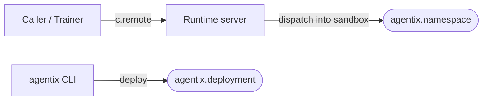

Agentix has **two** plugin axes — the things that cross the host↔sandbox
boundary. Each is a Python entry-point group; every plugin is a normal
pip-installable distribution declaring one TOML block. The framework
discovers them via `importlib.metadata` and exposes them through the
runtime, the dispatcher, or the CLI.



Both axes follow the same plug pattern:

```toml
[project.entry-points."agentix.<axis>"]
my-thing = "module:Thing"
```

What changes per axis is **how the framework consumes the plugins it
finds** — runtime imports namespaces on first dispatch; the CLI selects
one deployment by name.

## At a glance

| Axis                         | Group                  | Shape                                       | Built-ins                                            | When you reach for it                                       |
| ---------------------------- | ---------------------- | ------------------------------------------- | ---------------------------------------------------- | ----------------------------------------------------------- |
| [Namespaces](#namespaces)    | `agentix.namespace`    | **select-many**, lazy-load on first call    | (third-party only)                                   | Anything your trainer / harness calls into the sandbox      |
| [Deployments](#deployments)  | `agentix.deployment`   | **select-one** by CLI name                  | `local` / `daytona` / `e2b`                          | A new sandbox host (Fly, Modal, k8s, …)                     |

<Tip>
  **Why only two?** Plugin discovery exists to bridge process
  boundaries. Namespace code runs *inside* the sandbox; deployment code
  *provisions* the sandbox. Both legitimately need name-based dispatch
  across the host↔sandbox edge. Host-only helpers (trace sinks, the
  three built-in wire patterns, the CLI dispatcher, internal spec
  resolvers) don't — users integrate them by `import`ing and calling.
  See [Host-side extension hooks](#host-side-extension-hooks) below.
</Tip>

## Namespaces

**Group:** `agentix.namespace`   ·   **Shape:** select-many, lazy-load on first call

The dispatch surface. A namespace is a Python class whose
`@staticmethod` methods are remote-callable. The class itself is a pure
namespace — no instance state, no `self`. `c.remote(Bash.run, command="ls")`
reads `Bash.run.__module__` as the routing key, the runtime imports the
class on first call, and the method body runs inside the sandbox.

<Tabs>
  <Tab title="Caller side">
    ```python
    from agentix.bash import Bash
    result = await c.remote(Bash.run, command="echo hi")
    ```
  </Tab>
  <Tab title="Plugin side">
    ```python src/agentix/myagent/__init__.py
    from agentix.namespace import Namespace

    class MyAgent(Namespace):
        @staticmethod
        async def run(instruction: str) -> str:
            ...
    ```
  </Tab>
  <Tab title="pyproject.toml">
    ```toml
    [project.entry-points."agentix.namespace"]
    myagent = "agentix.myagent:MyAgent"

    [tool.hatch.build.targets.wheel]
    packages = ["src/agentix"]
    ```
  </Tab>
</Tabs>

**Why this shape.** Namespace code runs in the sandbox process, far
from any caller. Eager import would couple every namespace's startup
cost to every other; lazy load defers each namespace's import until its
first call, so a broken or unused namespace never blocks boot. Errors
surface at call time with the call's stack trace.

**When you write one.** New tool, new dataset, new model adapter,
new policy — anything the trainer / harness calls into the sandbox.

## Deployments

**Group:** `agentix.deployment`   ·   **Shape:** select-one by CLI name

Where the sandbox runs. A deployment backend is a class implementing
the three-method `Deployment` Protocol (`create`, `delete`, `get`). The
framework instantiates it with no arguments — backends read API keys,
regions, and other config from environment variables in their
`__init__`.

<Tabs>
  <Tab title="Caller side">
    ```bash
    # By CLI name — third-party backends slot into the same command:
    agentix deploy fly --image my-agent:0.1.0
    ```

    ```python
    # Or in code, after `pip install agentix-deployment-fly`:
    from agentix_deployment_fly import FlyDeployment
    from agentix.deployment.base import session

    async with session(FlyDeployment(), SandboxConfig(...)) as sandbox:
        # use sandbox.runtime_url
        ...
    ```
  </Tab>
  <Tab title="Plugin side">
    ```python
    from agentix.deployment.base import Deployment, Sandbox
    from agentix.models import SandboxConfig, SandboxInfo

    class FlyDeployment:
        async def create(self, config: SandboxConfig) -> Sandbox: ...
        async def delete(self, sandbox_id: str) -> None: ...
        async def get(self, sandbox_id: str) -> SandboxInfo: ...
    ```
  </Tab>
  <Tab title="pyproject.toml">
    ```toml
    [project.entry-points."agentix.deployment"]
    fly = "agentix_deployment_fly:FlyDeployment"
    ```
  </Tab>
</Tabs>

**Why this shape.** The CLI accepts one `<name>` argument, so the
framework needs a single class per `pip install`. Backends are
structural (Protocol) rather than inherited so a deployment can satisfy
the interface without coupling to framework machinery.

**When you write one.** A new sandbox host — Fly, Modal, k8s, a
managed-sandbox vendor, a local-process backend for tests. Backends
that talk to different APIs but share a Protocol are exactly the
shape this axis was designed for.

## Host-side extension hooks

The following are **not** plugin axes — they're plain Python you import
and call from your own startup code. Listed here for completeness.

### `agentix.trace.register_sink(fn)` — trace consumers

```python
from agentix.trace import register_sink

def my_sink(kind, payload, call_id, source):
    # forward to OTel / Sentry / your own bus
    ...

register_sink(my_sink)
```

Every namespace's `trace.emit(...)` fans out to every registered sink.
Sink errors are caught and logged; tracing never breaks a rollout.

### Wire patterns — three built-ins, not extensible

Three call shapes ship in `agentix.wire`: `UnaryPattern`,
`StreamPattern`, `BidiPattern`. Selection at bind time picks the most
specific match. There is no `register_pattern` hook — if a fourth call
shape ever becomes necessary, add it as a `WirePattern` subclass in
`agentix/wire.py` and the framework will pick it up.

### Spec resolvers — internal list

`agentix build` / `agentix install` accept short names, paths, and
image refs. The four built-in resolvers in `agentix/cli/_resolve.py`
are exhaustive for the spec shapes the CLI understands. A new shape
means editing that file.

### A new `agentix <verb>` CLI

The four built-in subcommands (`build`, `install`, `deploy`, `check`)
are hardcoded in `agentix/cli/__init__.py`. Third parties that want a
new top-level verb should ship a separate `console_scripts` binary —
`agentix-yourcmd` — rather than registering against the central
dispatcher.

## Cross-cutting principles

<Tip>
  **Lazy by default.** Namespace `ep.load()` is deferred until first
  dispatch; deployments load on first CLI call. A broken plugin only
  fails the call that needs it.
</Tip>

<Tip>
  **One source of truth.** The class IS the namespace; there's no
  stub-vs-impl shadow file. The `Deployment` Protocol is structural —
  no inheritance, no base class, just three methods.
</Tip>

<Tip>
  **Conflicts surface.** Two dists registering the same name in the
  same group raise `PluginConflictError`. Silent last-wins would hide
  stale installs.
</Tip>

<Tip>
  **Plugins are not the only extension mechanism.** Host-side hooks
  (`register_sink`, the wire-pattern list, internal resolvers) are
  plain Python — `import` and call. Plugin axes are reserved for
  things that cross the host↔sandbox boundary.
</Tip>
